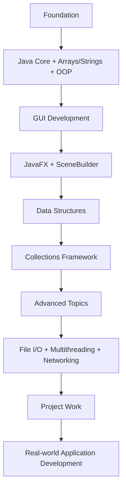

<<<<<<< HEAD
# Advanced Object Oriented Programming Course

[](https://github.com/yourusername/advanced-oop-course)
[](https://www.oracle.com/java/)
[](https://github.com/yourusername/advanced-oop-course)

## 📁 Directory Structure

```
📦 Advanced-OOP-Course/
├── 📚 Advanced_OOP_Documentation.md          # Complete course documentation
├── 📖 Week1_Learning_README.md               # Week 1 detailed learning guide
├── 📁 Practice/                              # Practice exercises and examples
│   └── 📁 Pra1/                             # Practice session 1
│       ├── 📄 README.md                     # Practice instructions
│       ├── 📁 src/                          # Source code files
│       │   ├── 📄 Main.java                 # Main program entry
│       │   └── 📄 NonPrimitiveDataTypes.java # Data types examples
│       ├── 📁 bin/                          # Compiled class files
│       └── 📄 build.bat                     # Build script
└── 📁 Documentation/                         # Additional course materials
    ├── 📄 Course_Overview.md                # Course introduction
    ├── 📄 Assessment_Criteria.md            # Grading and evaluation
    └── 📄 Study_Resources.md                # Learning resources
```

## 🎯 Course Overview

This course covers **Advanced Object-Oriented Programming** using Java, structured over **12 weeks** with hands-on practice and comprehensive assessment.

### 📅 Weekly Structure

| Week | Topic | Key Components |
|------|-------|----------------|
| **Week 1** | OOP Review | 3 Learning Stations |
| **Week 2** | GUI Basics | JavaFX Introduction |
| **Week 3** | JavaFX Graphics & SceneBuilder | Visual Design |
| **Week 4** | Collections Framework | Data Structures |
| **Week 5** | File I/O & Serialization | Data Persistence |
| **Week 6** | Multithreading in Java | Concurrent Programming |
| **Week 7** | Project Development | Real-world Application |
| **Week 8** | Networking | Client-Server Architecture |
| **Week 9** | Project Progress | Development Milestones |
| **Week 10** | Final Coding Test | Comprehensive Assessment |
| **Week 11** | Final Project Progress | Final Development |
| **Week 12** | Final Project Submission | Project Showcase |

### 🎓 Week 1 Detailed Structure

**✅ Station 1: Java Core Foundations**
- DataType, JavaToken, Operators, Data Conversion

**✅ Station 2: Arrays & Strings**
- Arrays, String Handling, Algorithms

**✅ Station 3: Object-Oriented Programming**
- Inheritance, Object Class, Encapsulation, Polymorphism

## 📊 Assessment Breakdown

| Component | Marks | Details |
|-----------|-------|---------|
| ✅ Attendance | **10** | Class participation |
| 💻 Coding Assignment | **10** | Individual tasks |
| 🧪 Coding Tests | **30** | 3 tests (10 each) |
| 📁 Project | **40** | Complete project |
| ┗ 📑 Report | **5** | Documentation |
| ┗ 💻 Code | **25** | Functionality |
| ┗ 🗣️ Presentation | **10** | Demo & presentation |
| **🎯 Total** | **100** | Complete assessment |

## 🚀 Quick Start

1. **📚 Read** [`Advanced_OOP_Documentation.md`](Advanced_OOP_Documentation.md) for complete course details
2. **📖 Study** [`Week1_Learning_README.md`](Week1_Learning_README.md) for Week 1 content
3. **💻 Practice** in the [`Practice/`](Practice/) directory
4. **📋 Review** documentation in [`Documentation/`](Documentation/) folder

## 📚 Key Files

| File | Description | Link |
|------|-------------|------|
| **📄 Advanced_OOP_Documentation.md** | Complete course guide | [View Documentation](Advanced_OOP_Documentation.md) |
| **📄 Week1_Learning_README.md** | Week 1 detailed learning | [View Week 1](Week1_Learning_README.md) |
| **📁 Practice/** | Hands-on exercises and code examples | [View Practice](Practice/) |

## 🎓 Learning Path



## 🌟 Features

- ✅ **Comprehensive Documentation** - Complete course coverage
- ✅ **Hands-on Practice** - Real coding exercises
- ✅ **Progressive Learning** - Step-by-step progression
- ✅ **Assessment Ready** - Clear evaluation criteria
- ✅ **GitHub Optimized** - Perfect for deployment

## 📖 Documentation Structure

```
📚 Advanced_OOP_Documentation.md
├── 📅 Course Structure (12 Weeks)
├── 📊 Assessment Criteria
├── 🎯 Learning Objectives
└── 📈 Success Strategies

📖 Week1_Learning_README.md
├── ✅ Station 1: Java Core Foundations
├── ✅ Station 2: Arrays & Strings
└── ✅ Station 3: Object-Oriented Programming
```

---

<div align="center">

**🎓 Advanced Object-Oriented Programming Course Documentation**

*Comprehensive, well-structured, and GitHub-ready documentation for advanced Java programming education.*

[](https://github.com/yourusername/advanced-oop-course)
[](https://github.com/yourusername/advanced-oop-course)

</div> 
=======
# Practice-AOOP-With-Sifat
Practice AOOP With Sifat - A comprehensive Java Advanced Object-Oriented Programming course featuring 12 weeks of structured learning with hands-on practice, GUI development, collections, multithreading, networking, and real-world project implementation.
>>>>>>> f80c730e274fc0a383453fadb23d75ea6c28ec1a
